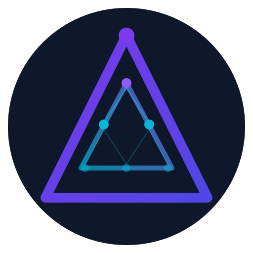

<p align="center">
  
</p>

<h1 align="center">Apex</h1>

<p align="center">
  <strong>A production-grade AI agent orchestrator for Claude Code.</strong>
</p>

<p align="center">
  <a href="https://github.com/karin478/Apex/actions"></a>
  <a href="https://github.com/karin478/Apex/blob/main/LICENSE"></a>
  <a href="https://golang.org"></a>
  <a href="https://github.com/karin478/Apex"></a>
</p>

Apex is a **CLI-based AI agent orchestrator** that decomposes complex tasks into **directed acyclic graphs (DAGs)**, executes them concurrently through **Claude Code CLI**, and wraps every action in a governance, audit, and safety framework designed for **autonomous AI operation**. Built in Go with 57 internal packages — no external runtime dependencies.

```
apex run "refactor the auth module, then update all tests, and finally update the docs"
```

Apex will classify risk, decompose into a 3-step DAG, execute in dependency order, audit every action with SHA-256 hash chains, and roll back automatically on failure.

<p align="center">
  
</p>

---

## Why Apex

Most AI agent wrappers are thin shells that pipe a prompt into an LLM and return the output. Apex treats AI task execution as a **first-class operational concern**:

- **DAG-based orchestration** — Multi-step tasks are decomposed into dependency graphs and executed concurrently, not sequentially.
- **Risk governance** — Every task is classified (LOW → CRITICAL) with configurable auto-approve, confirm, and reject policies.
- **Cryptographic audit trail** — SHA-256 hash-chained audit logs with daily anchors and git tag verification. Tamper-evident by design.
- **Automatic rollback** — Pre-execution snapshots with safe auto-restore on failure, preserving uncommitted work.
- **Execution sandbox** — Ulimit-based or Docker container isolation with configurable resource limits.
- **Zero external dependencies** — Filesystem-first architecture. No database server, no message queue, no cloud service required.

---

## Features

### Core Pipeline

| Feature | Description |
|---------|-------------|
| **Task Decomposition** | LLM-powered planner decomposes natural language into DAG nodes with dependency edges |
| **Concurrent Execution** | Configurable worker pool executes independent nodes in parallel |
| **Context Enrichment** | Automatic context building with token budget management |
| **Retry with Backoff** | Exponential backoff with configurable max attempts and delay |
| **Cost Estimation** | Dry-run mode with token count and cost estimates before execution |

### Safety & Governance

| Feature | Description |
|---------|-------------|
| **Risk Classification** | Phrase-based classifier with whole-word matching to minimize false positives |
| **Configurable Policy** | YAML-driven auto-approve / confirm / reject rules per risk level |
| **Kill Switch** | Emergency halt file that stops all running and future executions instantly |
| **Snapshot & Rollback** | Git stash-based snapshots with automatic restore on failure |
| **Fail-Closed Gate** | High-risk tasks require stronger sandbox isolation or are blocked |
| **Approval Workflow** | Per-node review and approve/skip for HIGH-risk DAG steps |
| **Dry-Run Mode** | Full planning + cost estimation without execution (`--dry-run`) |

### Observability & Audit

| Feature | Description |
|---------|-------------|
| **Hash-Chained Audit Log** | Every action produces a SHA-256 linked record in append-only JSONL |
| **Daily Anchors** | Automatic daily checkpoint with chain verification and git tags |
| **Causal Tracing** | Parent-child action ID linkage across DAG nodes |
| **Run Manifests** | Structured JSON record of every run with outcome, timing, and node results |
| **Policy Change Tracking** | Detects and logs config file modifications between runs |
| **Run Diff** | Side-by-side comparison of any two run manifests |
| **Metrics Export** | Prometheus-compatible metrics endpoint |
| **Dashboard** | Terminal-based system overview with health indicators |

### Data & Memory

| Feature | Description |
|---------|-------------|
| **Persistent Memory** | Sessions, facts, and decisions stored across runs |
| **Knowledge Graph** | Entity-relationship graph with traversal queries |
| **Semantic Search** | Vector similarity search over stored memories |
| **Content-Addressed Artifacts** | SHA-256 indexed artifact storage with lineage tracking |
| **Staging Pipeline** | Memory writes go through stage → verify → commit pipeline |
| **Memory GC** | Automatic cleanup of stale memories with configurable retention |

### Reliability

| Feature | Description |
|---------|-------------|
| **SQLite WAL State DB** | Crash-safe runtime state with single-writer queue |
| **Outbox Pattern** | Dual WAL+DB writes with crash reconciliation for action tracking |
| **File Locking** | Ordered flock-based locking prevents concurrent run conflicts |
| **Schema Migration** | Forward-compatible database migrations |
| **Health Monitor** | GREEN → YELLOW → RED → CRITICAL system health levels |

---

## Architecture

```
                    ┌──────────────────────────────────┐
                    │           apex run "task"         │
                    └──────────────┬───────────────────┘
                                   │
                    ┌──────────────▼───────────────────┐
                    │       Risk Classification        │
                    │   (LOW / MEDIUM / HIGH / CRITICAL)│
                    └──────────────┬───────────────────┘
                                   │
                    ┌──────────────▼───────────────────┐
                    │       LLM Planner (DAG)          │
                    │   Decompose → Validate → Order   │
                    └──────────────┬───────────────────┘
                                   │
              ┌────────────────────┼────────────────────┐
              │                    │                     │
       ┌──────▼──────┐    ┌───────▼──────┐    ┌────────▼─────┐
       │   Node A    │    │   Node B     │    │   Node C     │
       │  (claude)   │    │  (claude)    │    │  (claude)    │
       └──────┬──────┘    └───────┬──────┘    └────────┬─────┘
              │                    │                     │
              └────────────────────┼────────────────────┘
                                   │
                    ┌──────────────▼───────────────────┐
                    │     Audit · Anchor · Manifest    │
                    └──────────────────────────────────┘
```

**57 internal packages** organized by domain:

- `planner` — LLM-powered task decomposition
- `dag` — Thread-safe DAG with 15 node states
- `executor` — Claude Code CLI integration with sandbox wrapping
- `pool` — Concurrent worker pool with retry
- `governance` — Risk classification and configurable policy
- `audit` — Hash-chained logging, daily anchors, policy tracking
- `snapshot` — Git stash-based backup and restore
- `killswitch` — Emergency halt mechanism
- `statedb` — SQLite WAL runtime state
- `writerq` — Single-writer queue with batch transactions
- `outbox` — Crash-safe action tracking with reconciliation
- `memory` — Persistent session/fact/decision storage
- `kg` — Knowledge graph with entity-relationship queries
- `staging` — Memory write pipeline (stage → verify → commit)
- `sandbox` — Ulimit and Docker execution isolation

---

## Quick Start

### Prerequisites

- **Go 1.25+**
- **Claude Code CLI** installed and authenticated (`claude` in PATH)

### Install

```bash
go install github.com/lyndonlyu/apex/cmd/apex@latest
```

### Configure

```bash
mkdir -p ~/.apex
cat > ~/.apex/config.yaml << 'EOF'
claude:
  model: "claude-opus-4-6"
  effort: "high"
  timeout: 1800
  permission_mode: "acceptEdits"
planner:
  model: "claude-opus-4-6"
  timeout: 120
pool:
  max_concurrent: 4
retry:
  max_attempts: 3
  init_delay_seconds: 2
  multiplier: 2.0
  max_delay_seconds: 30
sandbox:
  level: "ulimit"
governance:
  auto_approve:
    - "LOW"
    - "MEDIUM"
  confirm:
    - "HIGH"
  reject:
    - "CRITICAL"
EOF
```

### Run

```bash
# Single task
apex run "analyze the error handling in this codebase"

# Multi-step task (auto-decomposed into DAG)
apex run "first refactor the auth module, then update tests, finally update docs"

# Preview without executing
apex run --dry-run "migrate the database schema and update all models"

# Non-interactive mode (CI/CD)
apex run --yes "run all tests and generate coverage report"
```

### Interactive Mode

```bash
$ apex

  ◆ Apex v0.1.0
  claude-opus-4-6 · ulimit · ~/my-project

  /help for commands · /quit to exit · Tab for autocomplete

❯ /model
  Model: claude-opus-4-6 (effort: high)

  ● 1.  opus      Most capable, best for complex tasks
    2.  sonnet    Balanced speed and capability
    3.  haiku     Fastest, best for simple tasks

❯ analyze the error handling in this codebase

  ◆ Response ─────────────────────────────
  Found 3 error handling patterns...
  ─────
  ✓ 8.2s · claude-opus-4-6 · LOW

❯ now refactor them to use fmt.Errorf
  Warning: MEDIUM risk. Proceed? (y/n): y
  Planning... 2 steps

  ┌ [1/2] Refactoring error handling
  └ ✓ Done

  ┌ [2/2] Updating tests
  └ ✓ Done

  ─────
  ✓ 2/2 steps · 18.5s · claude-opus-4-6 · MEDIUM

❯ /status
  ◆ Status ──────────────────────────────
  Claude CLI     2.1.50 (Claude Code)
  Model          claude-opus-4-6 (effort: high)
  Permissions    acceptEdits
  Sandbox        ulimit
  Pool           4 workers
  Session        2 turns · 1.2k chars context
  Health         GREEN

❯ /quit
Session saved. Goodbye!
```

**Features:**
- Session context persists across turns — follow-up tasks reference previous results
- 28 slash commands across 7 categories (`/help` to see all)
- Tab autocomplete for all commands
- Interactive model switching (`/model opus`, `/model 2`)
- Real-time system health monitoring (`/status`, `/doctor`)
- Dark/light theme support (`/theme dark`)
- Shell escape with `!` prefix (`!git status`)

---

## Commands

### Execution

| Command | Description |
|---------|-------------|
| `apex run <task>` | Execute a task (with `--dry-run`, `--yes` flags) |
| `apex plan <task>` | Preview DAG decomposition without executing |
| `apex review <proposal>` | Run adversarial review on a technical proposal |

### Monitoring

| Command | Description |
|---------|-------------|
| `apex status` | Show recent run history |
| `apex history` | Show task execution history |
| `apex trace [run-id]` | Show causal chain for a run |
| `apex diff <id-1> <id-2>` | Compare two run manifests |
| `apex dashboard` | System status overview |
| `apex analytics report` | Run history analytics |
| `apex metrics` | Export metrics |

### Safety

| Command | Description |
|---------|-------------|
| `apex doctor` | Verify system integrity (audit chain, anchors, health) |
| `apex kill-switch [reason]` | Activate emergency halt |
| `apex resume` | Deactivate kill switch |
| `apex snapshot list` | List available snapshots |
| `apex snapshot restore <id>` | Restore a snapshot |
| `apex precheck` | Run environment precheck |

### Data

| Command | Description |
|---------|-------------|
| `apex memory search <query>` | Search stored memories |
| `apex kg query <name>` | Query knowledge graph |
| `apex artifact list` | List content-addressed artifacts |
| `apex gc` | Clean up old runs, logs, and snapshots |

### Configuration

| Command | Description |
|---------|-------------|
| `apex mode list` | List execution modes |
| `apex profile list` | List configuration profiles |
| `apex template list` | List task templates |
| `apex plugin list` | List installed plugins |

---

## Testing

```bash
# Run all tests (698 tests across 57 packages)
go test ./...

# Run unit tests only
go test ./internal/...

# Run E2E tests
go test ./e2e/ -v

# Run specific package
go test ./internal/dag/ -v
```

**Test coverage:**
- 123 test files with 698 test functions
- Unit tests for every internal package
- E2E tests with isolated environments (temp HOME, mock Claude binary, real git repos)
- Configurable mock responses for deterministic testing

---

## Configuration Reference

```yaml
claude:
  model: "claude-opus-4-6"            # Claude model (opus, sonnet, haiku)
  effort: "high"                      # low | medium | high
  timeout: 1800                       # Max seconds per node execution
  binary: "claude"                    # Path to Claude CLI binary
  permission_mode: "acceptEdits"      # default | acceptEdits | bypassPermissions

planner:
  model: "claude-opus-4-6"            # Model for task decomposition
  timeout: 120                        # Max seconds for planning

pool:
  max_concurrent: 4                   # Parallel worker count (1-64)

retry:
  max_attempts: 3                     # Retry count per failed node (1-20)
  init_delay_seconds: 2               # Initial backoff delay
  multiplier: 2.0                     # Backoff multiplier (1.0-10.0)
  max_delay_seconds: 30               # Max backoff cap

sandbox:
  level: "ulimit"                     # none | ulimit | docker
  docker_image: "ubuntu:22.04"        # Docker image (if docker)
  memory_limit: "2g"                  # Docker memory limit
  cpu_limit: "2"                      # Docker CPU limit
  max_cpu_seconds: 300                # Ulimit CPU seconds
  max_file_size_mb: 100               # Ulimit file size

governance:
  auto_approve: ["LOW", "MEDIUM"]     # Risk levels to auto-approve
  confirm: ["HIGH"]                   # Risk levels requiring confirmation
  reject: ["CRITICAL"]                # Risk levels to reject

context:
  token_budget: 100000                # Max tokens per node context

redaction:
  patterns: ["sk-[a-zA-Z0-9]+"]      # Regex patterns to redact from audit logs
```

---

## Project Structure

```
apex/
├── cmd/apex/          # CLI entry point and command definitions
├── internal/
│   ├── planner/       # LLM task decomposition
│   ├── dag/           # DAG data structure and state machine
│   ├── executor/      # Claude CLI integration
│   ├── pool/          # Concurrent execution pool
│   ├── governance/    # Risk classification and policy
│   ├── audit/         # Hash-chained logging and anchors
│   ├── snapshot/      # Git-based backup and rollback
│   ├── killswitch/    # Emergency halt
│   ├── statedb/       # SQLite WAL runtime state
│   ├── writerq/       # Single-writer transaction queue
│   ├── outbox/        # Crash-safe action outbox
│   ├── memory/        # Persistent memory storage
│   ├── kg/            # Knowledge graph
│   ├── staging/       # Memory staging pipeline
│   ├── sandbox/       # Execution isolation
│   └── ...            # 40+ more packages
├── e2e/               # End-to-end tests
├── docs/
│   ├── plans/         # 96 design and implementation documents
│   └── reports/       # Test and review reports
└── go.mod
```

---

## Design Principles

1. **Filesystem-first** — All state lives in `~/.apex/`. No database server, no cloud dependency. Copy the directory to back up everything.

2. **Tamper-evident audit** — Every action is SHA-256 hash-chained. Daily anchors create verifiable checkpoints. `apex doctor` detects any tampering.

3. **Fail-safe defaults** — Unknown risk levels are rejected. Rollback is automatic. Kill switch halts everything instantly.

4. **Progressive enhancement** — Start with `sandbox: none` and `governance: auto_approve: [LOW]`. Add Docker isolation, approval workflows, and plugins as needed.

5. **Zero magic** — Configuration is explicit YAML. DAG decomposition is visible via `--dry-run`. Audit logs are human-readable JSONL.

---

## License

MIT

---

## Author

**Lyndon Lyu** — [@karin478](https://github.com/karin478)

---

<sub>**Keywords:** AI agent, Claude Code, CLI orchestrator, DAG execution, task automation, Go CLI tool, risk governance, audit trail, autonomous AI, LLM orchestration, Claude API, AI safety, code automation</sub>
